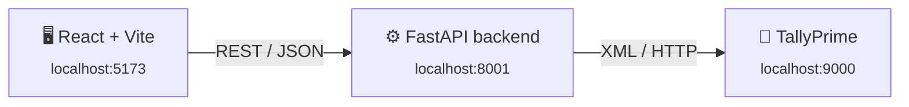

<div align="center">

# 📊 Tally Integration System

**A full‑stack web dashboard for TallyPrime — talk to your live Tally company from a modern browser UI.**

No middleware. No exported files. The backend speaks Tally's own XML/HTTP gateway directly.

[](https://www.python.org/)
[](https://fastapi.tiangolo.com/)
[](https://react.dev/)
[](https://vitejs.dev/)
[](#)

</div>

<br>



<br>

## ✨ Features

| | |
|---|---|
| 📒 **Ledgers & Groups** | Browse, create, edit, rename — plus a per‑party statement with running balance and a printable‑style detail view |
| 📦 **Stock Items, Groups, Categories & Units** | Full create/edit, GST & HSN detail, alternate‑unit conversions |
| 🧾 **Every voucher type, its own page** | Sales · Purchase · Receipt · Payment · Contra · Journal · Credit Note · Debit Note |
| ✏️ **Full‑page Create / Edit** | No cramped popups — voucher forms get the whole screen |
| 🔍 **Excel‑style tables** | Sticky headers, instant search, row actions, clean scrollbars everywhere |
| 📚 **Standalone API reference** | [`docs.html`](frontend/public/docs.html) — every field, gotcha, and sign convention, verified live. Zero dependency on this app. |

<br>

## 🏗️ Tech Stack

<div align="center">

| Layer | Stack |
|:---:|:---:|
| **Frontend** | React 19 · Vite · no router (in‑app page state) |
| **Backend** | Python 3 · FastAPI · httpx (async) |
| **Data source** | TallyPrime's built‑in XML/HTTP gateway — no plugins, no ODBC driver |

</div>

<br>

## ✅ Prerequisites

- **TallyPrime**, running, with the XML/HTTP server enabled
  `F1 (Help) → Settings → Connectivity → Client/Server configuration` → enable the ODBC/HTTP server (default port `9000`)
- **Python 3.11+**
- **Node.js 18+**

<br>

## 🚀 Getting Started

### 1 · Backend

```bash
cd backend
python -m venv .venv

# Windows
.venv\Scripts\activate
# macOS / Linux
source .venv/bin/activate

pip install -r requirements.txt
python -m uvicorn app.main:app --host 127.0.0.1 --port 8001
```

> API live at **http://127.0.0.1:8001** — interactive Swagger docs at `/docs`.

### 2 · Frontend

```bash
cd frontend
npm install
npm run dev
```

> Open **http://localhost:5173** — the dashboard connects to the backend automatically.

> [!IMPORTANT]
> Open Tally and load the company you want to work with **before** starting the backend.

<br>

## 📁 Project Structure

```
tallyintegration/
├── backend/
│   ├── app/
│   │   ├── main.py          # FastAPI routes
│   │   └── tally_client.py  # All Tally XML gateway logic (reads + writes)
│   └── requirements.txt
├── frontend/
│   ├── public/
│   │   └── docs.html        # Standalone Tally XML API reference
│   └── src/
│       ├── components/      # One component per master/voucher type
│       ├── api.js           # Thin fetch wrapper around the backend
│       └── App.jsx          # Sidebar + page routing
└── README.md
```

<br>

## 📖 API Reference

Click **"API Docs ↗"** in the app header, or open [`frontend/public/docs.html`](frontend/public/docs.html) directly. It covers:

- The exact XML shape for reading and writing **every** master type and voucher type
- Sign conventions — Tally is *not* consistent about what negative means across fields; this page says exactly where
- Every silent‑failure gotcha found by testing live: undocumented required fields, reserved‑value control characters, the correct voucher Alter/Delete identification mechanism, and more

> This page doesn't call this app's backend at all — copy any example and point it at your own Tally instance.

<br>

## ⚠️ Known Limitations

Found through extensive live testing against a real TallyPrime instance — documented so nothing is a surprise.

<details>
<summary><strong>Credit Note / Debit Note vouchers are read‑only</strong></summary>
<br>
Item‑invoice voucher types need a real existing voucher of that type to clone from — Tally's GST validation can't be satisfied by a hand‑built minimal XML. If your company has none yet, these two types stay read‑only.
</details>

<details>
<summary><strong>Master records can't be deleted from the app</strong></summary>
<br>
A malformed delete request triggered a genuine crash in Tally itself during testing. Deletion for masters (Ledgers, Stock Items, etc.) was intentionally left out rather than risk instability — delete them from Tally's own UI instead.
</details>

<details>
<summary><strong>A Tally "EDU" license caps how recent a voucher date can be</strong></summary>
<br>
TallyPrime EDU (free/educational) installations restrict voucher entry to dates up to a fixed cutoff. If voucher creation fails with <code>Voucher date is missing … retry Split</code>, check your license status before assuming something's broken — see <code>docs.html</code> for the full story.
</details>

<details>
<summary><strong>Fresh writes can lag in Tally's own read responses</strong></summary>
<br>
A newly created/edited/deleted voucher is genuinely committed instantly, but Tally's XML reads can take a few minutes to catch up. The app updates its own list optimistically, so this shouldn't be visible in normal use.
</details>

<br>

## 🔒 A Note on Scope

This project talks **directly** to your local TallyPrime instance over `localhost`. Nothing leaves your machine — no cloud sync, no external server, no telemetry.

<br>

<div align="center">

Built by testing live against a real TallyPrime instance, one XML request at a time.

</div>
